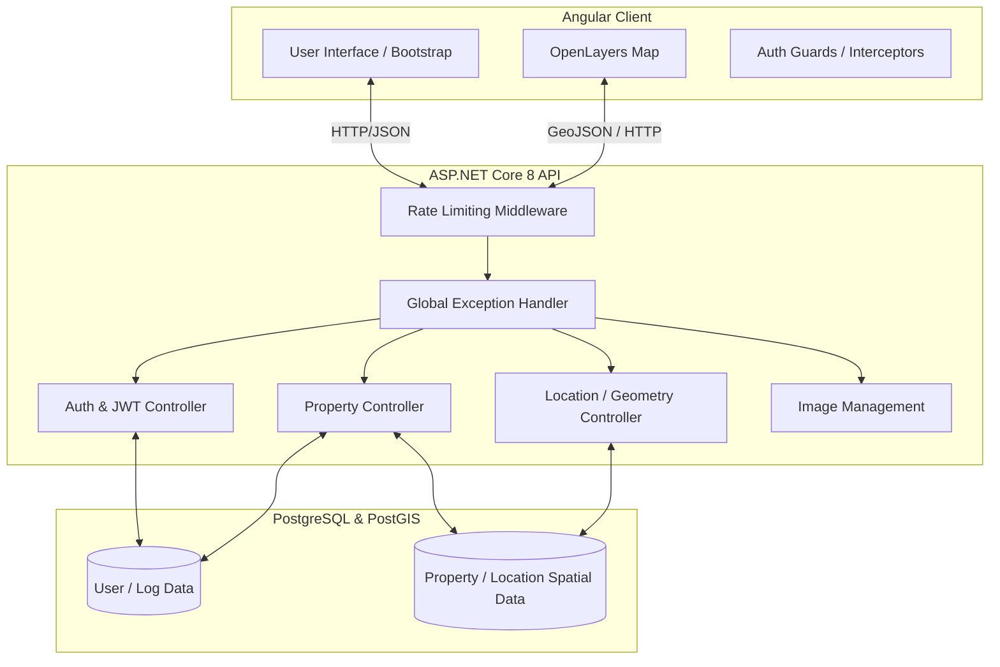

# Tasinmaz (Real Estate Management System) Documentation

## SECTION 1: High-Level Overview

### 1. Introduction
Tasinmaz is a comprehensive Real Estate Management System (REMS) designed to handle property data, geographical locations, user authentication, and system logs. The application empowers administrators and users to efficiently create, read, update, and delete property records, upload property images, and manage geographic geometries. Built with a modern tech stack, Tasinmaz provides a robust backend API and an interactive frontend interface utilizing map integrations for spatial property visualization.

### 2. Architecture & System Design
The system follows a classic decoupled client-server architecture:
- **Frontend (Client):** A Single Page Application (SPA) built with **Angular** and styled with **Bootstrap 5**. It utilizes **OpenLayers (ol)** for rendering interactive maps and visualizing property geometries.
- **Backend (Server):** An **ASP.NET Core 8.0** Web API that serves RESTful endpoints. It handles business logic, security (JWT Authentication), request rate limiting, and file processing (property images/Excel exports).
- **Database:** A **PostgreSQL** relational database. The backend uses **Entity Framework Core** as the ORM, coupled with **NetTopologySuite** to seamlessly store and query spatial data (geometries/locations).
- **Data Flow:** The Angular client sends HTTP requests (secured via JWT) to the ASP.NET Core API. The API validates the requests, interacts with the PostgreSQL database via EF Core, and returns JSON responses. Property images are handled via specialized endpoints and stored locally.

### 3. Diagrams



---

## SECTION 2: Getting Started (Installation & Setup)

### 1. Prerequisites
Ensure you have the following installed on your machine before setting up the project:
- **.NET 8.0 SDK** (for the backend API)
- **Node.js** (v18.x or higher) and **npm** (v11.x+)
- **Angular CLI** (`npm install -g @angular/cli`)
- **PostgreSQL** (v14+) with the **PostGIS** extension enabled (for spatial data support)

### 2. Local Development Setup

#### Backend Setup (.NET Core)
1. **Navigate to the backend directory:**
   ```bash
   cd "tasinmaz staj"
   ```
2. **Configure Environment Variables:**
   Create an `appsettings.Development.json` file if it doesn't exist, and configure your database connection and JWT secret.
   *Example `.env` / `appsettings.json` structure:*
   ```json
   {
     "ConnectionStrings": {
       "DefaultConnection": "Host=localhost;Port=5432;Database=tasinmazdb;Username=postgres;Password=yourpassword"
     },
     "Jwt": {
       "Key": "YourSuperSecretJWTKeyForLocalDevelopment123!",
       "Issuer": "TasinmazLocal"
     }
   }
   ```
3. **Apply Database Migrations:**
   ```bash
   dotnet ef database update
   ```
4. **Run the API:**
   ```bash
   dotnet run
   ```
   *The API will start at `https://localhost:5001` or `http://localhost:5000` and Swagger UI will be available at `/swagger`.*

#### Frontend Setup (Angular)
1. **Navigate to the frontend directory:**
   ```bash
   cd "tasinmaz staj frontend"
   ```
2. **Install dependencies:**
   ```bash
   npm install
   ```
3. **Configure API Endpoint:**
   Ensure your `src/environments/environment.ts` points to your local backend API URL (e.g., `http://localhost:5000/api`).
4. **Run the Angular application:**
   ```bash
   npm start
   ```
   *The application will be accessible at `http://localhost:4200`.*

### 3. Build & Deployment
- **Backend:** Publish the application using `dotnet publish -c Release -o ./publish`. The resulting artifact can be hosted on IIS, Docker, or any Linux/Windows server supporting .NET 8.
- **Frontend:** Build the production bundle using `npm run build`. This generates static files in the `dist/` folder, which can be served via Nginx, Apache, or any static hosting service.

---

## SECTION 3: Usage Guide & Core Features

### 1. Feature Walkthrough
- **Authentication & Authorization:** Users must log in to access the system. Upon login, a JWT is issued. The system supports secure logout by blacklisting the JWT (`jti` claim) in an in-memory cache.
- **Property Management:** Users can view a list of properties, add new properties with detailed metadata, update existing ones, and delete records. 
- **Map Integration (Geometries):** Users can define property boundaries or point locations using the integrated OpenLayers map interface. The API applies rate-limiting to geometry endpoints to prevent abuse (10 requests per minute).
- **Image Uploads:** Users can attach multiple images to a property record.
- **Export/Import:** The system supports exporting property data and system logs to external formats (e.g., Excel/PDF using ClosedXML/QuestPDF).

### 2. Code Examples

**Logging into the application via CLI (cURL):**
```bash
curl -X POST https://localhost:5001/api/Auth/login \
     -H "Content-Type: application/json" \
     -d '{"email":"admin@example.com", "password":"password123"}'
```
*Expected Output:*
```json
{
  "token": "eyJhbGciOiJIUzI1NiIsInR5cCI...",
  "expiration": "2026-08-21T18:00:00Z"
}
```

---

## SECTION 4: API & Component Reference

### 1. Endpoints Overview
- `POST /api/Auth/login` - Authenticate a user and return a JWT.
- `GET /api/Property` - Retrieve a list of properties.
- `POST /api/Property` - Create a new property record.
- `GET /api/Location/geometry/{id}` - Fetch spatial data for a specific property.

### 2. Specifications & Examples

**Endpoint:** Create Property
- **URL:** `/api/Property`
- **Method:** `POST`
- **Headers:** `Authorization: Bearer <token>`, `Content-Type: application/json`

**Request Body (JSON Example):**
```json
{
  "name": "Central Park View Apartment",
  "type": "Residential",
  "price": 1250000.00,
  "locationId": 14,
  "geometry": {
    "type": "Point",
    "coordinates": [35.2433, 38.9637]
  }
}
```

### 3. Responses

**Success Response (200 OK):**
```json
{
  "success": true,
  "message": "Property created successfully.",
  "data": {
    "id": 101,
    "name": "Central Park View Apartment"
  }
}
```

**Error Response (400 Bad Request):**
```json
{
  "type": "https://tools.ietf.org/html/rfc7231#section-6.5.1",
  "title": "One or more validation errors occurred.",
  "status": 400,
  "errors": {
    "name": [
      "The Name field is required."
    ]
  }
}
```

---

## SECTION 5: Code-Level Documentation & Maintainability

### 1. Directory Structure

```text
tasinmaz staj/
├── tasinmaz staj/                  # ASP.NET Core Backend
│   ├── Controllers/                # API Endpoints (Auth, Property, Location, etc.)
│   ├── Data/                       # EF Core DbContext and Configurations
│   ├── DTOs/                       # Data Transfer Objects for API requests/responses
│   ├── Entities/                   # Database Models (Property, User, Log)
│   ├── Interfaces/                 # Service contracts (e.g., IPropertyService)
│   ├── Middleware/                 # Custom middleware (GlobalExceptionHandler)
│   ├── Migrations/                 # EF Core database migrations
│   ├── Services/                   # Business logic implementation
│   └── Program.cs / Startup.cs     # Application bootstrapping & DI container setup
│
└── tasinmaz staj frontend/         # Angular Frontend
    ├── src/
    │   ├── app/                    # Angular components, services, and routing
    │   ├── assets/                 # Static assets (images, icons)
    │   └── environments/           # Environment configurations (dev, prod)
    ├── angular.json                # Angular CLI configuration
    └── package.json                # Frontend dependencies
```

### 2. Inline Commenting Strategy

For complex C# backend logic, utilize XML docstrings to ensure IntelliSense support and easy documentation generation (e.g., via Swashbuckle/Swagger).

**C# Backend Example:**
```csharp
/// <summary>
/// Calculates the total area of a given polygon geometry representing a property boundary.
/// </summary>
/// <param name="propertyId">The unique identifier of the property.</param>
/// <returns>The calculated area in square meters.</returns>
/// <exception cref="ArgumentException">Thrown when the property geometry is not a valid polygon.</exception>
public async Task<double> CalculatePropertyAreaAsync(int propertyId)
{
    // Fetch geometry from database ensuring we only load necessary spatial columns
    var geometry = await _geometryService.GetGeometryByIdAsync(propertyId);
    
    if (geometry.GeometryType != "Polygon")
    {
        throw new ArgumentException("Invalid geometry type for area calculation.");
    }
    
    return geometry.Area;
}
```

**TypeScript Frontend Example (JSDoc):**
```typescript
/**
 * Renders the property geometry on the OpenLayers map instance.
 * Centers the map view on the provided coordinates and applies default styling.
 * 
 * @param {GeoJSON} geoJsonData - The geometry data in GeoJSON format.
 * @param {boolean} zoomToExtent - Whether the map viewport should automatically zoom to fit the geometry.
 * @returns {void}
 */
renderPropertyOnMap(geoJsonData: any, zoomToExtent: boolean = true): void {
  // Logic to parse GeoJSON and add features to the vector layer
}
```

---

## SECTION 6: Troubleshooting & Contribution

### 1. Common Issues (FAQ)

**Issue: JWT Token Validation Fails / Unauthorized (401)**
- **Cause:** The token has expired, the Issuer/Key doesn't match the `appsettings.json`, or the token was blacklisted on logout.
- **Resolution:** Verify your `appsettings.json` JWT settings match exactly between generation and validation. If you logged out previously, the token is permanently revoked; request a new one via `/api/Auth/login`.

**Issue: Database Migration Fails (PostGIS Extension Missing)**
- **Cause:** Entity Framework is trying to map `Geometry` types, but PostgreSQL lacks the spatial extension.
- **Resolution:** Connect to your PostgreSQL database as a superuser and run: `CREATE EXTENSION postgis;` before applying EF migrations.

**Issue: Angular Map not rendering features**
- **Cause:** CORS blocking the request or invalid GeoJSON format.
- **Resolution:** Check the browser console for CORS errors. Ensure backend `Startup.cs` has `AllowAngular` CORS policy properly configured for `http://localhost:4200`.

### 2. Contribution Guidelines
- **Branching Strategy:** We use standard Git Flow. All new features should be developed on `feature/short-description` branches created from `develop`. Hotfixes branch from `main`.
- **Testing:** All new backend services must be accompanied by unit tests located in the `tasinmaz staj.Tests` project. Do not merge code that reduces overall code coverage.
- **Pull Requests (PR):** Open a PR against the `develop` branch. PRs must pass all automated builds and require at least one code review approval from a senior developer before merging. Ensure PR descriptions clearly define the "Why" and "What" of the changes.

*(Note: Certain environment configurations, precise API payloads, and detailed Angular component structures were assumed based on standard industry practices for an ASP.NET 8 + Angular GIS application setup.)*
