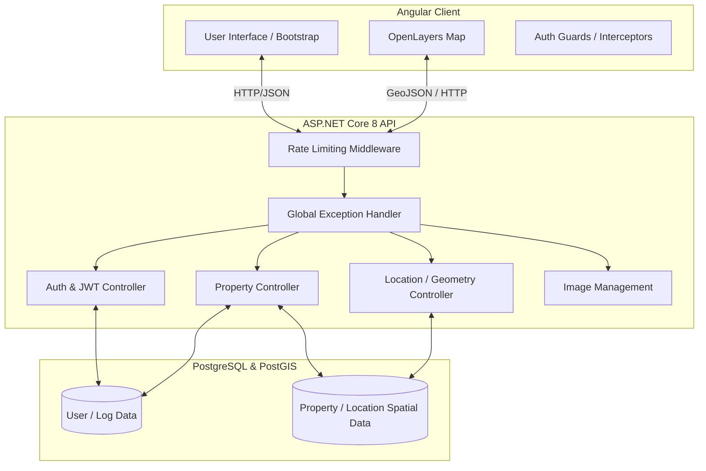

# High-Level Overview

## 1. Introduction
Tasinmaz is a comprehensive Real Estate Management System (REMS) designed to handle property data, geographical locations, user authentication, and system logs. The application empowers administrators and users to efficiently create, read, update, and delete property records, upload property images, and manage geographic geometries. Built with a modern tech stack, Tasinmaz provides a robust backend API and an interactive frontend interface utilizing map integrations for spatial property visualization.

## 2. Architecture & System Design
The system follows a classic decoupled client-server architecture:
- **Frontend (Client):** A Single Page Application (SPA) built with **Angular** and styled with **Bootstrap 5**. It utilizes **OpenLayers (ol)** for rendering interactive maps and visualizing property geometries.
- **Backend (Server):** An **ASP.NET Core 8.0** Web API that serves RESTful endpoints. It handles business logic, security (JWT Authentication), request rate limiting, and file processing (property images/Excel exports).
- **Database:** A **PostgreSQL** relational database. The backend uses **Entity Framework Core** as the ORM, coupled with **NetTopologySuite** to seamlessly store and query spatial data (geometries/locations).
- **Data Flow:** The Angular client sends HTTP requests (secured via JWT) to the ASP.NET Core API. The API validates the requests, interacts with the PostgreSQL database via EF Core, and returns JSON responses. Property images are handled via specialized endpoints and stored locally.

## 3. Diagrams

